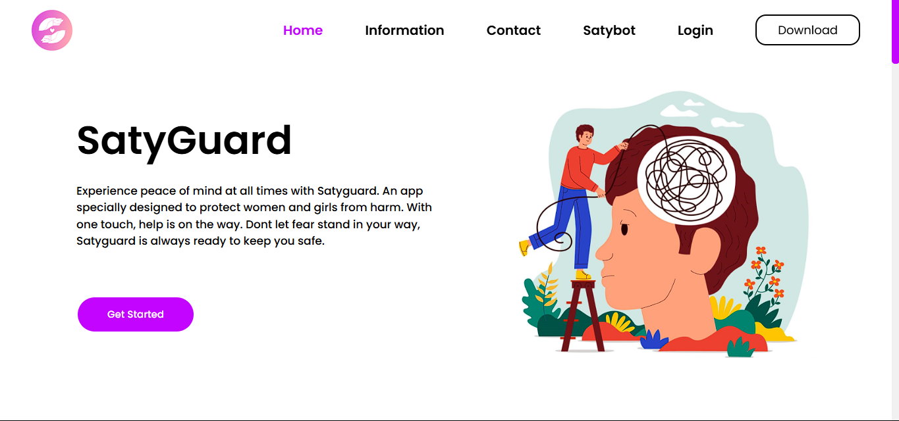
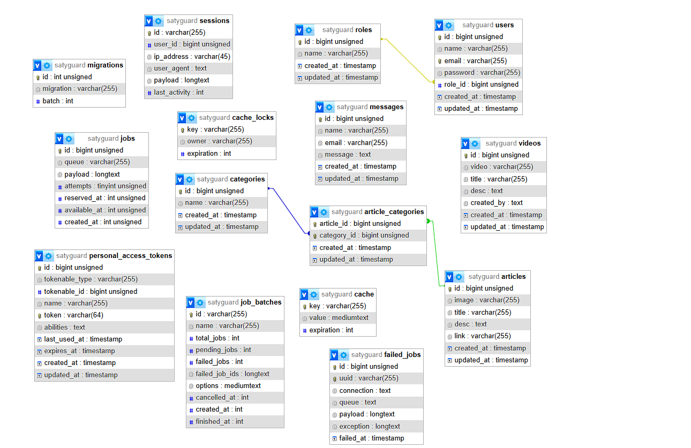
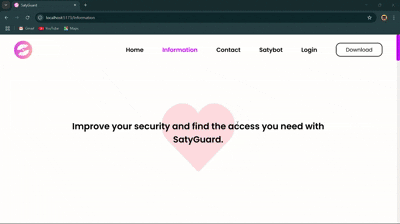
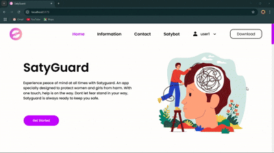

# SatyGuard Website

<p style="margin-top: 4px;" align="justify">
SatyGuard adalah platform digital yang dirancang untuk memberikan perlindungan dan dukungan psikologis bagi korban kekerasan serta meningkatkan kesadaran kesehatan mental. Website ini menyediakan fitur utama yaitu chatbot untuk konsultasi kesehatan mental dan mood detector berbasis AI yang menganalisis kondisi emosional pengguna. Selain itu, SatyGuard juga menghadirkan artikel edukatif dan komunitas pemulihan untuk membantu pengguna dalam mengatasi trauma. Dengan pendekatan inovatif yang menggabungkan teknologi dan psikologi, platform ini bertujuan menciptakan lingkungan yang lebih aman dan mendukung bagi individu yang rentan terhadap kekerasan dan gangguan mental.
</p>

## Framework & Bahasa yang Digunakan
<div align="center">
    
    
    
    
    
    
    
</div>

## ERD Database


## Cara Menjalankan Website

<p align="justify">
    Untuk menjalankan Website pastikan seluruh kode baik frontend, backend, dan machine learning dapat berjalan dengan baik
</p>

### 1. Menjalankan Kode Frontend
<p align="justify">
    Untuk menjalankan kode Frontend. Masuk ke dalam folder Frontend dengan mengetikkan path berikut
</p>

```sh 
cd ./Frontend
```

<p align="justify">
    Setelah itu install node modules dengan mengetikkan perintah dibawah ini
</p>

```sh 
npm install
```

<p align="justify">
    Lalu jalankan Frontendnya dengan perintah di bawah ini
</p>

```sh 
npm run dev --port=5173
```

### 2. Menjalankan Kode Backend
<p align="justify">
    Untuk menjalankan kode Backend. Masuk ke dalam folder Backend dengan mengetikkan path berikut
</p>

```sh 
cd ./Backend
```

<p align="justify">
    Setelah itu install vendor dan node modules dengan perintah berikut ini
</p>

```sh 
composer install
```

```sh 
npm install
```

<p align="justify">
    Kemudian import database satyguard.sql ke dalam mysql dengan nama satyguard, lalu hubungkan storage backend dengan mengetikkan perintah
</p>

```sh 
php artisan storage:link
```

<p align="justify">
    Jalankan Backendnya dengan perintah di bawah ini
</p>

```sh 
php artisan serve --port=8000
```

### 3. Menjalankan Machine Learning
<p align="justify">
    Untuk menjalankan kode Machine Learning. Masuk ke dalam folder Backend dengan mengetikkan path berikut
</p>

```sh 
cd ./Machine-Learning
```

<p align="justify">
    Setelah itu install library yang diperlukan python terlebih dahulu
</p>

```sh 
pip install flask flask-cors google-generativeai pandas scikit-learn
```

<p align="justify">
    Jalankan chatbot.py dengan perintah di bawah ini
</p>

```sh 
python chatbot.py
```

<p align="justify">
    Jalankan juga mood-detection.py dengan perintah di bawah ini
</p>

```sh 
python mood-detection.py
```

## Dokumentasi fitur-fitur Satyguard
<p align="justify">
    1. Landing page Home, Information, dan Download <br/>
    Di landing page ini terdapat berbagai penjelasan tentang kesehatan mental yang tentunya kami sajikan secara informatif dan interaktif baik berbentuk card, accordion, dan lain-lain. Kami juga menampilkan beberapa informasi dan video edukasi tentang kesehatan mental dari sumber yang terpercaya serta menampilkan informasi dalam berbentuk grafik dengan menggunakan Chart JS.
</p>


<p align="justify">
    2. Fitur Contact Me & Autentikasi Register dan Login <br/>
    Di fitur Contact Me, pengguna dapat memberikan pendapat serta saran mengenai website ini. Fitur register dan login pengguna dapat membuat akun baru dengan fitur register serta pengguna dapat login dengan menggunakan akunnya melalui fitur login. <br/>
    - Untuk akun pengguna yang kami sediakan adalah: Email: user1@gmail.com | Password: user1
</p>



<p align="justify">
    3. Fitur Satybot dan Mood Detection <br/>
    Di fitur Satybot, pengguna dapat menggunakan AI Chatbot dari SatyGuard untuk mencari informasi, meminta saran, curhat, dan lain sebagainya. Fitur Mood Detection, pengguna dapat mengetahui moodnya dengan cara pengguna mengetikkan sebuah teks mengenai perasaan yang sedang dialaminya. Setelah pengguna mengetikkan teksnya, maka hasil dari AI tersebut akan muncul dan jika mood pengguna sedang tidak baik-baik aja maka AI tersebut akan memberikan saran kepada pengguna supaya kondisi mood pengguna dapat membaik
</p>


<p align="justify">
    4. Panel Admin <br/>
    - Untuk akun pengguna yang kami sediakan adalah: Email: admin1@gmail.com | Password: admin1 <br/>
    Di dalam Panel Admin, Admin bisa mengatur isi dari Artikel, Video, Kategori Artikel, dan Pesan. Panel Admin juga dilengkapi sistem middleware Role, jadi jika user yang bukan admin mencoba masuk ke panel admin maka akan langsung diarahkan ke Login page kembali. <br/>
    - Untuk fiturnya sebagai berikut. <br/>
    1. Artikel: Admin bisa Create, Read, Update, Delete <br/>
    2. Kategori Artikel: Admin bisa Create, Read, Delete <br/>
    3. Video Edukasi: Admin bisa Create, Read, Update, Delete <br/>
    4. Pesan: Admin hanya bisa Read<br/>
</p>

